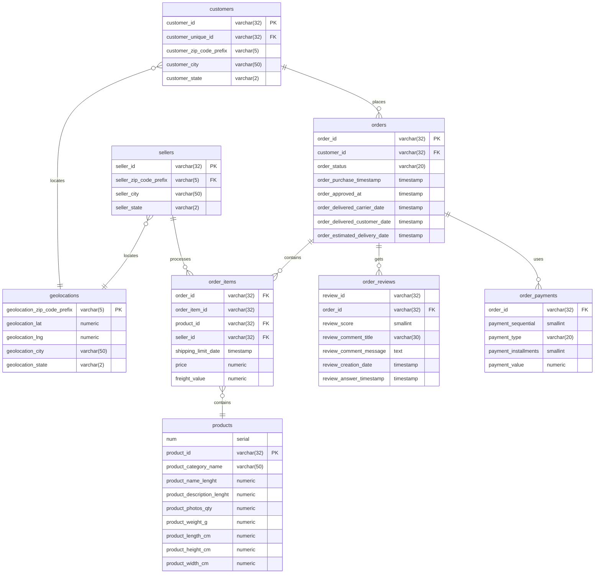

# Analyzing eCommerce Business Performance with SQL

## Project Background 
In this Mini Project, I play a member of an eCommerce company's Data Analytics team. This company is one of South America's major platforms for connecting tiny companies with their clients. As a member of the Data Analytics team, I am in charge of analyzing three areas of the company's financial performance. These three factors are client growth, product quality, and payment methods. I will analyze the data provided to create a business performance report on these three aspects.

## Task 01 : Data Preparation
Before starting data processing, the first step that must be done is to prepare raw data into structured data and ready to be processed. Here's what I do at Data Preparation Stage:

1. Download datasets given
2. Create a new database and tables for the prepared datasets by adjusting the data type of each column, also arranging Primary Keys and Foreign Keys for each table
3. Importing csv data into the database
4. Create entity relationships between tables based on the structure in the "Data Relationship"

<details>
  <summary>SQL Query</summary>
  
  ```sql
  -- Task 01 : Data Preparation --
CREATE TABLE IF NOT EXISTS products
(
	num serial,
	product_id varchar(32) PRIMARY KEY,
	product_category_name varchar(50),
	product_name_lenght numeric,
	product_description_lenght numeric,
	product_photos_qty numeric,
	product_weight_g numeric,
	product_length_cm numeric,
	product_height_cm numeric,
	product_width_cm numeric
);

CREATE TABLE IF NOT EXISTS geolocations
(
	geolocation_zip_code_prefix varchar(5),
	geolocation_lat numeric, 
	geolocation_lng numeric, 
	geolocation_city varchar(50), 
	geolocation_state varchar(2)
);

CREATE TABLE IF NOT EXISTS customers
(
	customer_id varchar(32) PRIMARY KEY,
	customer_unique_id varchar(32),
    -- seller_zip_code_prefix refers to geolocation.geolocation_zip_code_prefix. 
    -- not a Foreign Key because reference column is not unique.
	customer_zip_code_prefix varchar(5),
	customer_city varchar(50),
	customer_state varchar(2)
);

CREATE TABLE IF NOT EXISTS sellers
(
	seller_id varchar(32) PRIMARY KEY,
    -- seller_zip_code_prefix refers to geolocation.geolocation_zip_code_prefix. 
    -- not a Foreign Key because reference column is not unique.
	seller_zip_code_prefix varchar(5), 
	seller_city varchar(50),
	seller_state varchar(2)
);

CREATE TABLE IF NOT EXISTS orders
(
	order_id varchar(32) PRIMARY KEY,
	customer_id varchar(32) references customers(customer_id),
	order_status varchar(20),
	order_purchase_timestamp timestamp,
	order_approved_at timestamp,
	order_delivered_carrier_date timestamp,
	order_delivered_customer_date timestamp,
	order_estimated_delivery_date timestamp
);

CREATE TABLE IF NOT EXISTS order_items
(
	order_id varchar(32) references orders(order_id),
	order_item_id varchar(32),
	product_id varchar(32) references product(product_id),
	seller_id varchar(32) references seller(seller_id),
	shipping_limit_date timestamp,
	price numeric,
	freight_value numeric
);

CREATE TABLE IF NOT EXISTS order_reviews
(
	review_id varchar(32),
	order_id varchar(32) references orders(order_id),
	review_score smallint,
	review_comment_title varchar(30),
	review_comment_message text,
	review_creation_date timestamp,
	review_answer_timestamp timestamp
);

CREATE TABLE IF NOT EXISTS order_payments
(
	order_id varchar(32) references orders(order_id),
	payment_sequential smallint,
	payment_type varchar(20),
	payment_installments smallint,
	payment_value numeric
);
  ```
</details>
<br>


<br>Fig.1. Data Relationship

Below is entity relationship diagram created based on interpretation of Data Relationship:


Fig.2. Entity Relationship Diagram

## Task 02 : Annual Customer Activity Growth Analysis
One of the metrics used to measure eCommerce business performance is customer activity that interacts on the eCommerce platform. In this task, I will analyze several metrics related to customer activity such as the number of active customers, the number of new customers, the number of customers who make repeat orders and also the average transactions made by customers every year.

<details>
  <summary>SQL Query</summary>
  
  ```sql
-- Task 02 : Annual Customer Activity Growth Analysis --
WITH temp1 AS(
    -- Displays the average number of monthly active users for each year --
    WITH active_users AS(
        SELECT 
            EXTRACT (YEAR FROM o.order_purchase_timestamp) purchase_year, 
            EXTRACT(MONTH FROM o.order_purchase_timestamp) purchase_month,
            COUNT(DISTINCT c.customer_unique_id) AS monthly_active_users
        FROM 
            orders o JOIN customers c ON o.customer_id = c.customer_id
        GROUP BY 
            purchase_year, purchase_month
    )
    SELECT 
        purchase_year,
        FLOOR(AVG(monthly_active_users)) monthly_active_users
    FROM 
        active_users
    GROUP BY 
        purchase_year
),
temp2 AS(
    -- Displays the number of new customers in each year --
    WITH min_order AS (
        SELECT 
            c.customer_unique_id,
            MIN(o.order_purchase_timestamp) AS min_time_order
        FROM 
            orders o JOIN customers c ON o.customer_id = c.customer_id
        GROUP BY 
            customer_unique_id
    )
    SELECT 
        EXTRACT(YEAR FROM min_time_order ) AS purchase_year, 
        COUNT (DISTINCT customer_unique_id) new_customers
    FROM 
        min_order
    GROUP BY 
        purchase_year
),
temp3 AS(
    -- Displays the number of customers who make purchases more than once (repeat orders) in each year --
    WITH repeat_order AS(
        SELECT 
            EXTRACT(YEAR FROM o.order_purchase_timestamp) purchase_year,
            c.customer_unique_id,
            COUNT(o.order_purchase_timestamp) jumlah
        FROM 
            orders o JOIN customers c ON o.customer_id = c.customer_id
        GROUP BY purchase_year, c.customer_unique_id
        HAVING COUNT(o.order_purchase_timestamp) > 1
        ORDER BY 3 DESC
    )
    SELECT 
        purchase_year,
        COUNT(DISTINCT customer_unique_id) repeat_order_customers
    FROM repeat_order
    GROUP BY purchase_year
),
temp4 AS(
    -- Displays the average number of orders made by customers for each year --
    WITH temp AS(
        SELECT 
            EXTRACT(YEAR FROM o.order_purchase_timestamp) purchase_year,
            c.customer_unique_id,
            COUNT(order_id) order_freq
        FROM
            orders o JOIN customers c ON o.customer_id = c.customer_id
        GROUP BY
            purchase_year, c.customer_unique_id
        ORDER BY 
            order_freq DESC
    )
    SELECT 
        purchase_year,
        ROUND(AVG(order_freq), 3) avg_order_freq
    FROM 
        temp
    GROUP BY 
        purchase_year
)
-- Combine the information that has been obtained into a single table view --
SELECT 
    temp1.purchase_year,
    temp1.monthly_active_users,
    temp2.new_customers,
    temp3.repeat_order_customers,
    temp4.avg_order_freq
FROM 
    temp1 
    JOIN temp2 ON temp1.purchase_year = temp2.purchase_year
    JOIN temp3 ON temp1.purchase_year = temp3.purchase_year
    JOIN temp4 ON temp1.purchase_year = temp4.purchase_year
;
  ```
</details>

## Task 03 : Annual Product Category Analysis
ECommerce business performance is of course very closely related to the products available in it. Analyzing the quality of products in eCommerce can provide decisions for developing a better business. In this task, I will analyze the performance of each existing product category and how it relates to the company's revenue.

<details>
  <summary>SQL Query</summary>
  
  ```sql
-- Task 03 : Product Category Analysis --
-- Create a table that contains total company revenue/revenue information for each year -- 
CREATE TABLE total_revenue AS
	SELECT 
		EXTRACT(YEAR FROM o.order_purchase_timestamp) purchase_year,
		SUM(oi.price + oi.freight_value) revenue
	FROM 
		order_items oi JOIN orders o ON oi.order_id = o.order_id
	WHERE
		o.order_status = 'delivered'
	GROUP BY 
		purchase_year
;

-- Create a table that contains information on the total number of cancel orders for each year -- 
CREATE TABLE canceled_order_year AS
	SELECT 
		EXTRACT(YEAR FROM order_purchase_timestamp) purchase_year,
		COUNT(order_id) canceled_order
	FROM 
		orders
	WHERE
		order_status = 'canceled'
	GROUP BY 
		purchase_year
;

-- Create a table containing the product category names 
-- that provide the highest total revenue for each year
CREATE TABLE top_revenue_category AS(
	WITH revenue_category AS (
		SELECT 
			EXTRACT(YEAR FROM o.order_purchase_timestamp) purchase_year,
			p.product_category_name,
			SUM(oi.price + oi.freight_value) revenue,
			RANK() OVER (
				PARTITION BY EXTRACT(YEAR FROM o.order_purchase_timestamp)
				ORDER BY SUM(oi.price + oi.freight_value) DESC
			) revenue_rank
		FROM
			product p
			JOIN order_items oi ON p.product_id = oi.product_id
			JOIN orders o ON oi.order_id = o.order_id
		WHERE
			o.order_status = 'delivered'
		GROUP BY 1,2
	)
	SELECT 
		purchase_year,
		product_category_name,
		revenue
	FROM
		revenue_category
	WHERE
		revenue_rank = 1
)
;

-- Create a table containing the names of the product categories 
-- that have the highest number of canceled orders for each year 
CREATE TABLE most_canceled_category AS(
	WITH canceled_category AS (
		SELECT 
			EXTRACT(YEAR FROM o.order_purchase_timestamp) purchase_year,
			p.product_category_name,
			COUNT(o.order_id) total_canceled,
			RANK() OVER (
				PARTITION BY EXTRACT(YEAR FROM o.order_purchase_timestamp)
				ORDER BY COUNT(o.order_id) DESC
			) canceled_rank
		FROM
			product p
			JOIN order_items oi ON p.product_id = oi.product_id
			JOIN orders o ON oi.order_id = o.order_id
		WHERE
			o.order_status = 'canceled'
		GROUP BY 1,2
	)
	SELECT 
		purchase_year,
		product_category_name,
		total_canceled
	FROM
		canceled_category
	WHERE
		canceled_rank = 1
)
;

-- Combine the information that has been obtained into a single table view --
SELECT 
	tr.purchase_year "year",
	tr.revenue total_revenue,
	trc.product_category_name most_profitable_category,
	trc.revenue category_profit,
	co.canceled_order total_canceled_order,
	mcc.product_category_name most_canceled_category,
	mcc.total_canceled canceled_order_category
FROM 
	total_revenue tr
	JOIN top_revenue_category trc ON tr.purchase_year = trc.purchase_year
	JOIN canceled_order_year co ON tr.purchase_year = co.purchase_year
	JOIN most_canceled_category mcc ON tr.purchase_year = mcc.purchase_year
;
  ```
</details>

## Task 04 : Annual Payment Type Usage Analysis
ECommerce businesses generally provide an open-payment-based payment system that allows customers to choose various types of payment available. Analyzing the performance of existing payment types can provide insight to better create strategic partnerships with payment service providers. In this task, I will analyze the types of payments available and look at the changing trends that have occurred over the last few years.

<details>
  <summary>SQL Query</summary>
  
  ```sql
-- Task 04 : Analysis of Annual Payment Type Usage --
-- Displays the total usage of each type of payment at all time, sorted from the favorite --
SELECT
	payment_type,
	COUNT(*) total_payment_type
FROM
	order_payments
GROUP BY
	1
ORDER BY
	2 DESC
;

-- Displays detailed information on the amount of usage for each type of payment for each year --
WITH payment_type_year AS(
	SELECT
		op.payment_type,
		EXTRACT(YEAR FROM o.order_purchase_timestamp) purchase_year
	FROM
		order_payments op
		JOIN orders o ON op.order_id = o.order_id
)
SELECT
	payment_type,
	SUM (CASE WHEN purchase_year = 2016 THEN 1 ELSE 0 END) "2016",
	SUM (CASE WHEN purchase_year = 2017 THEN 1 ELSE 0 END) "2017",
	SUM (CASE WHEN purchase_year = 2018 THEN 1 ELSE 0 END) "2018",
	COUNT(1) total_number
FROM
	payment_type_year
GROUP BY
	1
ORDER BY
	5 DESC
;
  ```
</details>
