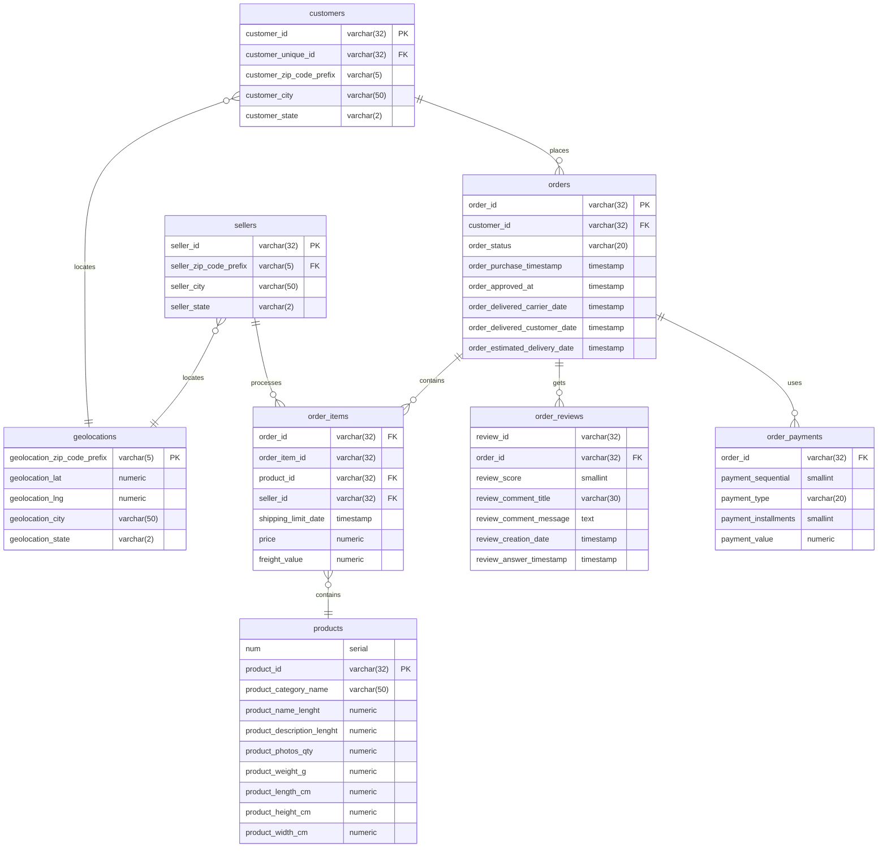

# Mini-Project-01
Mini Project 01 : Analyzing eCommerce Business Performance with SQL

## Project Background 
In this Mini Project, I play a member of an eCommerce company's Data Analytics team. This company is one of South America's major platforms for connecting tiny companies with their clients. As a member of the Data Analytics team, I am in charge of analyzing three areas of the company's financial performance. These three factors are client growth, product quality, and payment methods. I will analyze the data provided to create a business performance report on these three aspects.

## Data Preparation
Before starting data processing, the first step that must be done is to prepare raw data into structured data and ready to be processed. Here's what I do at Data Preparation Stage:

1. Download datasets given
2. Create a new database and tables for the prepared datasets by adjusting the data type of each column, also arranging Primary Keys and Foreign Keys for each table
3. Importing csv data into the database
4. Create entity relationships between tables based on the structure in the "Data Relationship"
 

 Fig.1. Data Relationship

Below is entity relationship diagram created based on interpretation of Data Relationship:

Fig.2. Entity Relationship Diagram

## Annual Customer Activity Growth Analysis

## Annual Product Category Analysis

## Annual Payment Type Usage Analysis